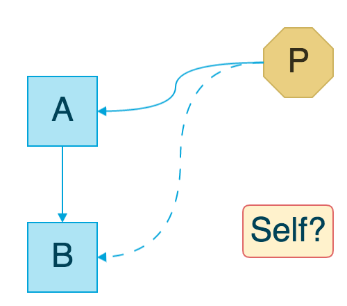

class: center, middle

# Swifty Core Data

####How I used protocol and protocol extension to help with Core Data

???

Title slide

name: Agenda

# Agenda

1. NSManagedObject extensions: Protocol extensions to the rescue
How I used protocol extension to extend data layer classes and have them some commonly used functions.
2. Using Protocols to hide away persistence layer
3. Testing the created protocols
4. Swift 3's impact on these ideas

---
class: middle

```
class Task: NSManagedObject {
  @NSManaged var id: NSNumber
  @NSManaged var text: String
}
```

???
Let us take a sample class `Task` which we want to save in Core Data.
Class has an `id` and text.
---
class: middle

```
extension Task {
  class func object(managedObjectContext: NSManagedObjectContext,
                    predicate: NSPredicate?)
                    -> Task? {
    let fetchRequest = NSFetchRequest(entityName: "Task")
    fetchRequest.predicate = predicate
    guard let result = try? managedObjectContext.executeFetchRequest(fetchRequest) else {
      print("Error getting object of entity \(self)")
      return nil
    }
    assert(result.count <= 1)
    return result.first as? Task
  }
}
```

???
We define a method we require

We define a single method on class `Task` which gives back an optional `Task` based on provided predicate.
The method

---
class: middle

```
extension Task {
* class func object(managedObjectContext: NSManagedObjectContext,
                    predicate: NSPredicate?)
                    -> Task? {
    let fetchRequest = NSFetchRequest(entityName: "Task")
    fetchRequest.predicate = predicate
    guard let result = try? managedObjectContext.executeFetchRequest(fetchRequest) else {
      print("Error getting object of entity \(self)")
      return nil
    }
    assert(result.count <= 1)
    return result.first as? Task
  }
}
```

####1. This function is tied to `NSManagedObjectContext` and would need a rewrite if we decide to change the persistence layer.

---
class: middle

```
extension Task {
  class func object(managedObjectContext: NSManagedObjectContext,
                    predicate: NSPredicate?)
*                    -> Task? {
    let fetchRequest = NSFetchRequest(entityName: "Task")
    fetchRequest.predicate = predicate
    guard let result = try? managedObjectContext.executeFetchRequest(fetchRequest) else {
      print("Error getting object of entity \(self)")
      return nil
    }
    assert(result.count <= 1)
*   return result.first as? Task
  }
}
```

####2. This function would need to be copied to any other class too that requires it.

---
class: middle

```
extension Task {
  class func object(managedObjectContext: NSManagedObjectContext,
                    predicate: NSPredicate?)
                     -> Task? {
*   let fetchRequest = NSFetchRequest(entityName: "Task")
    fetchRequest.predicate = predicate
    guard let result = try? managedObjectContext.executeFetchRequest(fetchRequest) else {
      print("Error getting object of entity \(self)")
      return nil
    }
    assert(result.count <= 1)
    return result.first as? Task
  }
}
```

####3. And when moving, remember to change the entity name, the compiler won't help you there.

---
class: center, middle

##So we have a non-reusable strongly tied method

---
class: center, middle

##Let's fix it...

---
class: middle

```
extension NSManagedObject {
  class func managedObject(managedObjectContext: NSManagedObjectContext,
                           predicate: NSPredicate?)
                           -> NSManagedObject? {
    let fetchRequest = NSFetchRequest(entityName: "Task")
    fetchRequest.predicate = predicate
    guard let result = try? managedObjectContext.executeFetchRequest(fetchRequest) else {
      print("Error getting object of entity \(self)")
      return nil
    }
    assert(result.count <= 1)
    return result.first as? NSManagedObject
  }
}
```

???

First attempt
####We move this function to an extension on `NSManagedObject` instead.

---
class: middle, center

###*Easy, Right?*

---
class: middle

```
*extension NSManagedObject {
  class func managedObject(managedObjectContext: NSManagedObjectContext,
                           predicate: NSPredicate?)
                           -> NSManagedObject? {
    let fetchRequest = NSFetchRequest(entityName: "Task")
    fetchRequest.predicate = predicate
    guard let result = try? managedObjectContext.executeFetchRequest(fetchRequest) else {
      print("Error getting object of entity \(self)")
      return nil
    }
    assert(result.count <= 1)
    return result.first as? NSManagedObject
  }
}
```

####1. Every `NSManagedObject` class gets it, by default, even if we don't want it to.

---
class: middle

```
extension NSManagedObject {
* class func managedObject(managedObjectContext: NSManagedObjectContext,
                           predicate: NSPredicate?)
                           -> NSManagedObject? {
    let fetchRequest = NSFetchRequest(entityName: "Task")
    fetchRequest.predicate = predicate
    guard let result = try? managedObjectContext.executeFetchRequest(fetchRequest) else {
      print("Error getting object of entity \(self)")
      return nil
    }
    assert(result.count <= 1)
    return result.first as? NSManagedObject
  }
}
```

####2. We are still tied up with Core Data.
####Function `managedObject` is not available to classes not using Core Data as persistence layer.

---
class: middle

```
extension NSManagedObject {
  class func managedObject(managedObjectContext: NSManagedObjectContext,
                           predicate: NSPredicate?)
*                          -> NSManagedObject? {
    let fetchRequest = NSFetchRequest(entityName: "Task")
    fetchRequest.predicate = predicate
    guard let result = try? managedObjectContext.executeFetchRequest(fetchRequest) else {
      print("Error getting object of entity \(self)")
      return nil
    }
    assert(result.count <= 1)
    return result.first as? NSManagedObject
  }
}
```

####3. The return type of the function is `NSManagedObject`. So whenever you want to use it, you type cast it.

```
Task.managedObject(mainManagedObjectContext, predicate: nil)
* as! Task
```

---
class: middle

```
extension NSManagedObject {
  class func managedObject(managedObjectContext: NSManagedObjectContext,
                           predicate: NSPredicate?)
                           -> NSManagedObject? {
*   let fetchRequest = NSFetchRequest(entityName: "Task")
  fetchRequest.predicate = predicate
  guard let result = try? managedObjectContext.executeFetchRequest(fetchRequest) else {
    print("Error getting object of entity \(self)")
    return nil
  }
  assert(result.count <= 1)
  return result.first as? NSManagedObject
}
```

####4. That is *NOT* the name of all our entities.

---
class: center, middle

###Hmm, so extending NSManagedObject wasn't a very good solution..

---
class: middle, center

###Easy, Right?
## *NO*

???
*I wouldn't have added so many negative points to my solution! So obvious 😁*

---
class: middle, center

##Let us fix the *entity name* issue first

---
class: middle

```
extension NSManagedObject {
  class func entityName() -> String {
    return NSStringFromClass(self)
*   .componentsSeparatedByString(".").last! // *
  }
}
```

.footnote[.simple[*] Module name is prepended to string representations of classes in swift]

---
class: middle

```
extension NSManagedObject {
  class func managedObject(managedObjectContext: NSManagedObjectContext,
                           predicate: NSPredicate?)
                           -> NSManagedObject? {
* let fetchRequest = NSFetchRequest(entityName: entityName())
  fetchRequest.predicate = predicate
  guard let result = try? managedObjectContext.executeFetchRequest(fetchRequest) else {
    print("Error getting object of entity \(self)")
    return nil
  }
  assert(result.count <= 1)
  return result.first as? NSManagedObject
}
```

---
class: middle, center

###*Entity name issue solved*

##😪

---
class: middle, center

###Back to original problem of getting managed classes to answer

##`object`

---
class: center, middle

**Enter,**

#Protocol Extensions
##Protocol Extensions
###Protocol Extensions
...

---
class: center, middle

###But first we need a protocol!

---
class: center, middle

###Let us start by naming the protocol

---
class: center, middle

#Entity

---
class: center, middle

#👏

???
Some well deserved applause for myself

---
class: middle, center

###Any object that wants to work with our model layer is now an

#`Entity`

---
class: middle

```
protocol Entity {
}
```

---
class: middle

```
protocol Entity {
  static func name() -> String
}
```

The first requirement of the protocol is to have a name.

---
class: middle, center

###We know what this method has to do for `NSManagedObject`

???
remind about entityName slide

---
class: middle

####Let us add this to an extension, *on protocol*.

```
extension Entity
  where Self: NSManagedObject {
  static func entityName() -> String {
    return NSStringFromClass(self)
    .componentsSeparatedByString(".").last!
  }
}
```

---
class: middle

```
extension Entity
* where Self: NSManagedObject {
  static func entityName() -> String {
    return NSStringFromClass(self)
    .componentsSeparatedByString(".").last!
  }
}
```

???

Explain the where clause
also tell what self here represents
---
class: middle

####  Next we add the method `object`
```
protocol Entity {
  static func object(managedObjectContext: NSManagedObjectContext,
                     predicate: NSPredicate?)
                     -> NSManagedObject?
}
```

???

Tied to core data
Returns a NSManagedObject
---
class: middle

```
protocol Entity {
  static func object(managedObjectContext: NSManagedObjectContext,
                     predicate: NSPredicate?)
*                    -> Self?
}
```

???

explain self reference

---
class: middle

```
*Task
.managedObject(mainManagedObjectContext, predicate: nil)
```

???
The returned object is now of correct type.
---
class: middle, center

##Still using `NSManagedObjectContext`!

---
class: middle, center

##Why?

???

We are still asking the object from a NSManagedObjectContext. Skip that and lets start using context.

---
class: center, middle

##Welcome associatedType

---
class: middle

```
protocol Entity {
* associatedType Context
* static func object(context: Context,
                     predicate: NSPredicate?)
                     -> Self?
}
```

---
class: center, middle

##Finally no trace of Core data!

???
explain a bit about associatedType and how it is to be implemented by conforming classes.
Get ready to implement a default implementation.

---
class: middle

```
protocol Entity {
  associatedType Context
  static func object(predicate: NSPredicate?,
*                    context: Context)
                     -> Self?
}
```


The order of the parameters is of significance here.

Apple keeps context as first param and I have always found increased readability when I follow what Apple is doing. Just FWIW note.


```
func CGContextSetFlatness(_ c: CGContext?, _ flatness: CGFloat)
func CGContextSetLineDash(_ c: CGContext?, _ phase: CGFloat, _ lengths: UnsafePointer<CGFloat>, _ count: Int)
func CGContextSetInterpolationQuality(_ c: CGContext?, _ quality: CGInterpolationQuality)
//...
```

???

Just ask people to follow the convention.

---
class: middle, center

###Moving on

---
class: middle

```
extension Entity where Context == NSManagedObjectContext {
  static func object(context: Context, predicate: NSPredicate?) -> Self? {
  let req = NSFetchRequest(entityName: entityName())
  req.predicate = predicate
  guard let result = try? context.executeFetchRequest(req) else {
    logger.error("Error getting object of entity \(self)")
    return nil
  }
  assert(result.count <= 1)
  return result.first as? Self
  }
}
```

???

Move to next slides for explanation

---
class: middle, center

###Too much code
##Break it

---
class: middle

```
extension Entity where Context == NSManagedObjectContext {
```

???
Explain that this is available only when context is NSManagedObjectContext
where clause on associatedType

---
class: middle

```
static func object(context: Context, predicate: NSPredicate?)
-> Self? {
```

???
Explain that Context and NSManagedObjectContext are same because of previous statement.
so autocomplete FTW

---
class: middle

```
let req = NSFetchRequest(entityName: entityName())
```

???
Explain that entityName() is given in protocol and thus safe to call by the extension method.

---
class: middle

```
return result.first as? Self
```

???
Explain type cast required because `executeFetchRequest` returns `[AnyObject]`.

---
class: middle

```
extension Entity where Context == NSManagedObjectContext {
  static func object(context: Context, predicate: NSPredicate?) -> Self? {
  let req = NSFetchRequest(entityName: entityName())
  req.predicate = predicate
  guard let result = try? context.executeFetchRequest(req) else {
    logger.error("Error getting object of entity \(self)")
    return nil
  }
  assert(result.count <= 1)
  return result.first as? Self
  }
}
```

???
Look at this again to see complete implementation

---
class: middle, center

# Conformance

---
class: middle

```
extension Task: Entity {
  typealias Context = NSManagedObjectContext
}
```

???
Explain how it gets entityName() and the default implementation for `object`.

---
class: middle, center

##Sweet!
##👌

---
class: middle, center

## Time to see imperfections in our world
---
class: middle, center

####Gotcha #1

###An associatedType can not be fulfilled by the protocol extension

???
And thus we require to do the typealias

---
class: middle, center

####Gotcha #2

###We can not have non-final classes

---
class: middle, center



####Since the protocol extension method returns an instance of type `Self?`, the Swift compiler would not allow any non-final class to use this default implementation!

???
This because, any non-final class `C` is unable to say that when `C` and its subclass `S` conform to the protocol, what type is `Self`.

---
class: middle, center

##Override?

???
for new persistence layer
Do note that this is the default implementation for the protocol method. Any conforming class can still override it (without explicitly saying override).

---
class: middle, center

###Now any class conforming to the protocol defines its own context to use.
###So your `Entity` could be using `NSUserDefaults` as Context and the protocol would not bat an eye!

---
class: middle

```
final class Account {
  typealias Context = NSUserDefaults

  static func entityName() -> String {
    return "KeyForAccountInUserDefaults"
  }

  class func object(context: Context,
                    predicate: NSPredicate?) -> Account? {
    return context.objectForKey(entityName()) as? Account
  }
}
```

???
Explain how the persistence layer has been abstracted out. This class's object
can now be kept in an array [Entity] and worked on by functions.

---
class: middle, center

#Testing

---
class: middle, center

###No changes to existing tests

---
class: middle, center

###Except name changes maybe
###🤔

???
(to the new protocol methods)

Example: managedObject -> object

---
class: middle, center

###The tests can choose to ignore the protocol totally

???
The conforming classes/structs can be tested with the methods they implement.
name changes maybe again

---
class: middle

```
func testEntityName() {
  XCTAssertEqual("Account", Account.entityName())
}
```

???
Example of protocol being ignored
---
class: middle

```
func testObjectSavedIsReturned() {
  let moc = testContext()
  guard let account = NSEntityDescription
                      .insertNewObjectForEntityForName(Account.entityName(),
                        inManagedObjectContext: moc)
                        as? Account else {
    assertionFailure()
    return
  }
  account.id = NSNumber(unsignedInt: arc4random())
  moc.saveContext()

* guard let retrievedAccount = Account.object(nil, context: moc) else {
    assertionFailure()
    return
  }
  XCTAssertEqual(retrievedAccount.id, account.id)
}
```

???
might have named the function account before which changed to this.

---
class: middle, center

You can get the presentation and test project at
####https://www.github.com/ayushgoel/wtb
